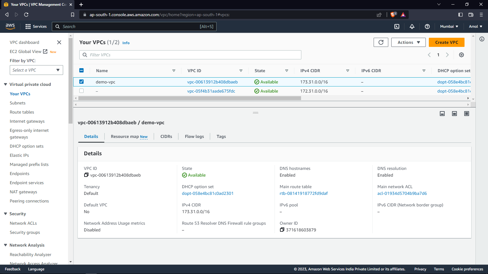
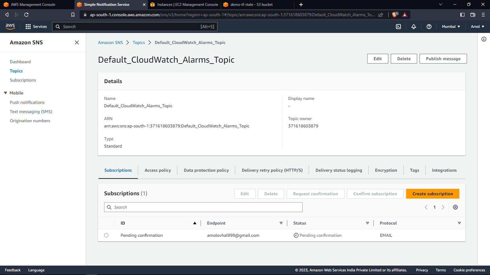

# **Combination of IaaC and and Configuration management tool to deploy application on a demo environment**


## **<u>Task Description</u>** :
1. Use Terraform to deploy following things:
- VPC
- Public Subnets
- Private Subnets
- Launch Template
- Auto Scaling Group of EC2 Machine with Latest ubuntu image
- Application Load Balancer for above auto scaling group
- MySQL RDS
- SNS Topic and subscription
- Cloudwatch CPU and RAM utilization metric and Alert (Alerts should be sent to SNS Topic subscribers)

2. Deploy a sample application with Ansible
- Application should be deployed on auto scaling group created in previous step
- MySQL database connection should happen


Follow best practices while creating infrastructure.

```
```
## **<u>Creating Infrastructure on AWS cloud using Terraform</u>** :
-   Configuring S3 as backend to store tfstate file remotely.

-   Creating Network 
    - VPC
    - Public Subnets and Private Subnets
    - Public Route Table with Internet Gateway
    - Private Route Table with NAT Gateway
    - Public Application Loadbalancer and Security Group


```
```

```
```

```
```

```
```

```
```

```
```

```
```

```
```

-   Creating HA-EC2_ALB
    - Creating High Availability EC2 Application Loadbalancer setup in Private Subnet.
    - Created Auto Scaling Group and Target Group
    - Load Balancer listner rules

```
```

```
```

```
```

-   Bastion Host
    -  Created Bastion Host in public subnet for accessing the HA-EC2-ALB setup created in private subnets. 


```
```

```
```

- SNS Topic And Subscription Creation.


```
```

```
```

```
```

```
```

-   RDS MySQL
    - Created RDS MySQL db instance and allowed only internal traffic on mysql port i.e. 3306. 


```
```

```
```

```
```
-   Ansible Role
    - Created Ansible Role for deployment of Application on HA-EC2-ALB setup.
    - Created Ansible Dynamic Inventory.
    - Custom Ansible configuration.


```
```

```
```
-   Application Deployment
    - Application Deployed on url: http://application.amolovhal.com/Spring3HibernateApp/
    - Applciation Source Code: https://github.com/opstree/spring3hibernate


```
```

```
```

```
```

